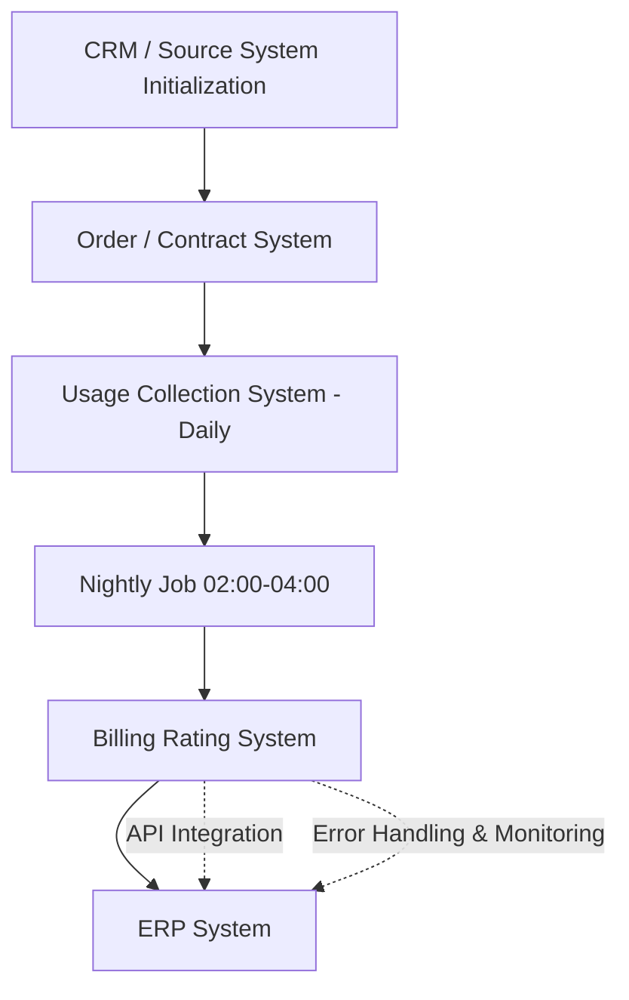

# Usage-Based Billing Process - Exercise 1

## Process Flow



---

# Database Schema

## customer

```sql
postgres=# SELECT * FROM customer;

 id | name | contract_start_date
----+------+---------------------
  1 | a    | Jan-15-2026
  2 | b    | Feb-20-2026
  3 | c    | Feb-06-2026
  4 | d    | Mar-01-2026
  5 | e    | Mar-12-2026
  6 | f    | Apr-03-2026
```

---

## contract

```sql
postgres=# SELECT * FROM contract;

 id | customer_id | start_date | end_date
----+-------------+------------+------------
  1 |           1 | Jan-15-2026| Jan-14-2027
  2 |           5 | Mar-12-2026| Mar-11-2027
  3 |           2 | Feb-20-2026| Feb-19-2027
  4 |           3 | Feb-06-2026| Feb-05-2027
  5 |           4 | Mar-01-2026| Feb-28-2027
```

---

## usage

```sql
postgres=# SELECT * FROM usage;

 id | customer_id | contract_line_item_id | usage_duration_ts
----+-------------+-----------------------+---------------------------------------------------
  1 |           1 |                     1 | 01-01-2026 09:20:34 - 01-01-2026 10:43:00
  2 |           1 |                     1 | 02-01-2026 11:00:02 - 02-01-2026 13:30:35
  3 |           1 |                     7 | 03-01-2026 08:00:11 - 03-01-2026 09:15:10
  4 |           2 |                     3 | 04-01-2026 10:10:55 - 04-01-2026 12:00:01
  5 |           3 |                     5 | 05-01-2026 13:22:00 - 05-01-2026 15:45:33
  6 |           4 |                     2 | 06-01-2026 07:15:19 - 06-01-2026 08:00:40
```

---

## item

```sql
postgres=# SELECT * FROM item;

 id |       name        | charge_type | price
----+-------------------+-------------+-------
  1 | onboarding forms  | ongoing     | $33
  2 | analytics api     | ongoing     | $1.5
  3 | sms automation    | ongoing     | $0.8
  4 | onboarding setup  | fixed       | $250
  5 | premium support   | fixed       | $120
```

---

## contract_item_link

```sql
postgres=# SELECT * FROM contract_item_link;

 contract_id | item_id | quantity_of_fixed_price_item
-------------+---------+------------------------------
           1 |       1 | 3
           1 |       2 | 1
           2 |       3 | 5
           3 |       1 | 2
           4 |       4 | 1
           5 |       5 | 1
```

---

## daily_usage

```sql
postgres=# SELECT * FROM daily_usage;

 id | customer_id | item_id | usage_date | total_usage_duration | is_processed_2am_4am
----+-------------+---------+------------+----------------------+----------------------
  1 |           1 |       1 | 01-01-2026 | 05:10:45             | 1
  2 |           1 |       2 | 03-01-2026 | 01:00:10             | 1
  3 |           2 |       1 | 04-01-2026 | 03:22:11             | 1
  4 |           3 |       3 | 05-01-2026 | 02:10:00             | 1
  5 |           4 |       2 | 06-01-2026 | 07:45:33             | 1
```

---

## invoice

```sql
postgres=# SELECT * FROM invoice;

 id | customer_id | total_price | billing_date
----+-------------+-------------+---------------
  1 |           1 |        1200 | Jan-14-2026
  2 |           2 |        3700 | Feb-19-2026
  3 |           3 |         950 | Mar-05-2026
  4 |           4 |        2100 | Mar-31-2026
  5 |           5 |        4300 | Apr-11-2026
```

---

## charge

```sql
postgres=# SELECT * FROM charge;

 id | invoice_id | item_id | quantity | total_price
----+------------+---------+----------+-------------
  1 |          1 |       1 |        5 | $100
  2 |          1 |       2 |     null | $1100
  3 |          2 |       3 |       10 | $800
  4 |          2 |       4 |        1 | $2900
  5 |          3 |       2 |        3 | $950
  6 |          4 |       5 |        1 | $2100
```

Comment:
- null quantity = ongoing/fixed recurring charge.
- charge acts as the link between invoice and daily_usage.

---

# Relationships

```text
customer             1 -> 1     contract
contract             1 -> many  contract_item_link
item                 1 -> many  contract_item_link
contract_item_link   1 -> many  daily_usage
invoice              1 -> many  charge
customer             1 -> many  invoice
contract             1 -> many  invoice
```

---

# ERP Synchronization

1. Billing Rating System calculates finalized charges.
2. Middleware/API layer transforms internal billing schema into ERP-compatible format.
3. Invoice data is sent to ERP through REST API integration.
4. ERP creates the official invoice and returns invoice ID + status.
5. Internal `invoice` table is updated accordingly.

---

# Error Handling & Monitoring

- Failed ERP synchronizations are logged and retried automatically.
- Billing process stops if usage data is incomplete.
- Monitoring alerts if invoices are not generated before 09:00.
- Dead-letter queue isolates failed records without stopping the full billing cycle.
- Daily scheduled jobs are monitored for completion status.

