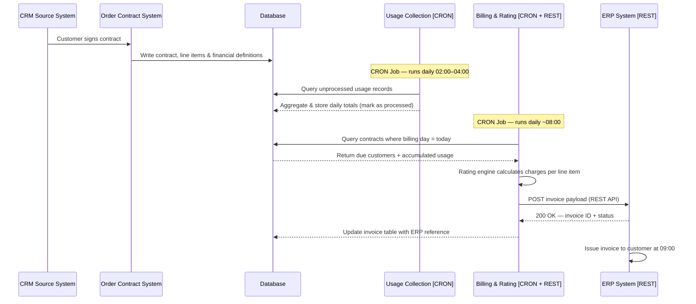
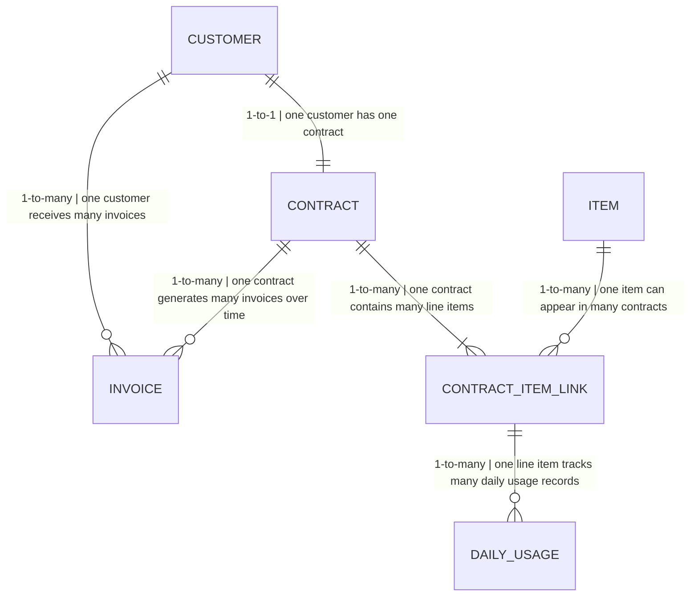

# Usage-Based Billing Process - Exercise (1)

## Process Flow


**1. Contract setup**
The process starts in the CRM when a customer signs a contract. The Order/Contract System receives the event and persists the full contract record to the database — including the `contract_start_date`, all line items, and the financial definitions that map each product to an ERP billing code. This date becomes the anchor for every future billing cycle.

**2. Daily usage collection — CRON Job (02:00–04:00)**
A CRON job runs every night in a fixed window. It queries all usage records that have not yet been processed, aggregates them by customer and product into daily totals, writes those totals to `daily_usage`, and marks each source row as processed. This prevents double-counting on the next run and keeps the job idempotent. The process is completely independent of billing — it runs every night regardless of whether any invoice is due.

**3. Billing, rating, and invoicing — CRON Job + REST Client**
A second CRON job runs each morning (around 08:00, before the 09:00 issuance deadline). To determine which customers owe an invoice today, it queries the `contract` table for all active contracts where the **day-of-month of `contract_start_date` equals today's date** — for example, on the 15th it finds every customer whose contract started on any 15th. For each matched customer, the Rating engine pulls all `daily_usage` rows accumulated since the last billing cycle and calculates the total charge per line item (usage-based items priced by consumption, fixed items by unit). The finalized invoice is pushed to the ERP system via a REST API call. The ERP returns a confirmation with an invoice ID, which is stored in the `erp_invoice_id` column of the internal `invoice` table — enabling reconciliation and preventing duplicate submissions on retries. The ERP then issues the invoice to the customer at 09:00 AM.

---

## Database Schema

### customer

```sql
postgres=# SELECT * FROM customer;

 id | name | contract_start_date
----+------+---------------------
  1 | a    | Jan-15-2026
  2 | b    | Feb-20-2026
  3 | c    | Feb-06-2026
  4 | d    | Mar-01-2026
  5 | e    | Mar-12-2026
  6 | f    | Apr-03-2026
```

---

### contract

```sql
postgres=# SELECT * FROM contract;

 id | customer_id | start_date | end_date
----+-------------+------------+------------
  1 |           1 | Jan-15-2026| Jan-14-2027
  2 |           5 | Mar-12-2026| Mar-11-2027
  3 |           2 | Feb-20-2026| Feb-19-2027
  4 |           3 | Feb-06-2026| Feb-05-2027
  5 |           4 | Mar-01-2026| Feb-28-2027
```

---

### usage

```sql
postgres=# SELECT * FROM usage;

 id | customer_id | contract_line_item_id | usage_duration_ts
----+-------------+-----------------------+---------------------------------------------------
  1 |           1 |                     1 | 01-01-2026 09:20:34 - 01-01-2026 10:43:00
  2 |           1 |                     1 | 02-01-2026 11:00:02 - 02-01-2026 13:30:35
  3 |           1 |                     7 | 03-01-2026 08:00:11 - 03-01-2026 09:15:10
  4 |           2 |                     3 | 04-01-2026 10:10:55 - 04-01-2026 12:00:01
  5 |           3 |                     5 | 05-01-2026 13:22:00 - 05-01-2026 15:45:33
  6 |           4 |                     2 | 06-01-2026 07:15:19 - 06-01-2026 08:00:40
```

---

### item

```sql
postgres=# SELECT * FROM item;

 id |       name        | charge_type | price
----+-------------------+-------------+-------
  1 | onboarding forms  | ongoing     | $33
  2 | analytics api     | ongoing     | $1.5
  3 | sms automation    | ongoing     | $0.8
  4 | onboarding setup  | fixed       | $250
  5 | premium support   | fixed       | $120
```

---

### contract_item_link

```sql
postgres=# SELECT * FROM contract_item_link;

 contract_id | item_id | quantity_of_fixed_price_item
-------------+---------+------------------------------
           1 |       1 | 3
           1 |       2 | 1
           2 |       3 | 5
           3 |       1 | 2
           4 |       4 | 1
           5 |       5 | 1
```

---

### daily_usage

```sql
postgres=# SELECT * FROM daily_usage;

 id | customer_id | item_id | usage_date | total_usage_duration | is_processed_2am_4am
----+-------------+---------+------------+----------------------+----------------------
  1 |           1 |       1 | 01-01-2026 | 05:10:45             | 1
  2 |           1 |       2 | 03-01-2026 | 01:00:10             | 1
  3 |           2 |       1 | 04-01-2026 | 03:22:11             | 1
  4 |           3 |       3 | 05-01-2026 | 02:10:00             | 1
  5 |           4 |       2 | 06-01-2026 | 07:45:33             | 1
```

---

### invoice

```sql
postgres=# SELECT * FROM invoice;

 id | customer_id | total_price | billing_date | erp_invoice_id | erp_status
----+-------------+-------------+--------------+----------------+------------
  1 |           1 |        1200 | Feb-15-2026  | ERP-10021      | confirmed
  2 |           2 |        3700 | Mar-20-2026  | ERP-10034      | confirmed
  3 |           3 |         950 | Mar-06-2026  | ERP-10028      | confirmed
  4 |           4 |        2100 | Apr-01-2026  | ERP-10045      | confirmed
  5 |           5 |        4300 | Apr-12-2026  | NULL           | failed
```

---


## Relationships



## Assumptions

- A customer may have multiple contracts over time (e.g., renewals or upgrades). The current model simplifies this to a 1:1 relationship, but the schema should add a `contract_id` FK on the `invoice` table if multi-contract support is needed.

## ERP Synchronization

1. Billing Rating System calculates finalized charges.
2. Middleware/API layer transforms internal billing schema into ERP-compatible format.
3. Invoice data is sent to ERP through REST API integration.
4. ERP creates the official invoice and returns invoice ID + status.
5. Internal `invoice` table is updated with `erp_invoice_id` and `erp_status` accordingly.

---

## Error Handling & Monitoring

- Any invoice with `erp_invoice_id IS NULL` was never successfully confirmed by the ERP — the billing CRON queries this on retry runs to re-attempt only unconfirmed submissions.
- `erp_status = 'failed'` distinguishes a rejected ERP call from `pending` (not yet attempted), giving on-call engineers precise visibility into what went wrong and at which stage.
- Failed ERP synchronizations are logged and retried automatically.
- Billing process stops if usage data is incomplete.
- Monitoring alerts if invoices are not generated before 09:00.
- Dead-letter queue isolates failed records without stopping the full billing cycle.
- Daily scheduled jobs are monitored for completion status.

---

# Open AR for Customer Group (NetSuite) - Exercise (2)

## 1.  Entity Relationship Diagram (ERD)
The system utilizes a relational schema with a self-referencing hierarchy and linked transactions. This structure allows the system to identify "Top-Level" parents and aggregate all related financial data.

Relationships Map
Customer Self-Join (1:M): A Parent Customer can be linked to multiple Sub-customers via the parent field.

Customer to Invoice (1:M): Each Customer (Parent or Sub) can have many Invoices via the entity foreign key.

Invoice Internal Hierarchy (1:M): Each Invoice contains one Mainline (Header) row and multiple Line Item rows.

### Customers:
id (PK, Integer)

entity_id (String) — e.g., "1 (HiBob HQ)"

parent (FK, references Customers.id) — NULL for Parents/Standalones.

custentity_cumulative_ar (Decimal) — The target custom field for aggregation.

### Invoices:
id (PK, Integer)

entity (FK, references Customers.id)

amount_remaining (Decimal)

status (String) — Values: 'open', 'closed'

mainline (Boolean) — 'T' for Header, 'F' for Line Items

## 2. Step-by-Step Process Flow
This section describes the logical journey the system takes to ensure data accuracy and hierarchy integrity.

1. Entry Point & Identification
The process begins by scanning the Customer database. It specifically looks for "Top-Level" entities—records where the parent field is empty. This ensures that the calculation "bucket" starts only at the HQ or Standalone level, automatically skipping sub-customers to prevent redundant data entry.

2. Scope Definition
For every Top-Level customer identified, the system defines its "Family Tree."

If it’s a Parent (e.g., HiBob), the scope includes itself and all children.

If it’s a Standalone (e.g., Monday.com), the scope is limited to itself.

3. Financial Data Extraction (Filtering)
The system queries the Invoice table using three "Safety Filters" to ensure the sum is accurate:

Entity Match: It only looks at invoices belonging to the "Family Tree" identified in Step 2.

Status Check: It ignores any invoices marked as 'Paid' or 'Void', focusing strictly on 'Open' balances.

Mainline Isolation: It filters for Mainline = T. This ensures the script only reads the total bill amount from the header, ignoring individual item lines to avoid double-counting.

4. Aggregation
The system sums the amount_remaining from all valid invoices found in the previous step.

Example: If Fiverr owes $10k and Wiz owes $13k, the system holds a temporary total of $23k for the HiBob Group.

5. Data Commitment
Finally, the system performs a "Surgical Update." It writes the total sum into the custentity_cumulative_ar field on the Top-Level record only. Because the script was designed to ignore sub-customers in Step 1, their fields remain clean and empty as per the business requirements.

The following tables demonstrate the logic across three distinct scenarios: HiBob Group (Parent-Sub), Wix Group (Parent-Sub), and Monday.com (Standalone).

### Customer Entity Table
```sql
postgres=# SELECT id, entity_id, parent_fk, custentity_cumulative_ar, type FROM customers;

 id | entity_id (Name) | parent_fk | custentity_cumulative_ar | Type       
----+------------------+-----------+--------------------------+------------
  1 | 1 (HiBob HQ)     | [NULL]    | 23000                    | Parent     
  2 | 2 (Fiverr)       | 1         | [NULL]                   | Sub        
  3 | 3 (Wiz)          | 1         | [NULL]                   | Sub        
  4 | 4 (Wix HQ)       | [NULL]    | 12000                    | Parent     
  5 | 5 (Canva)        | 4         | [NULL]                   | Sub        
  6 | 6 (Figma)        | 4         | [NULL]                   | Sub        
  7 | 7 (Monday.com)   | [NULL]    | 5000                     | Standalone 
```

### Invoice Transaction Table
```sql

postgres=# SELECT id, entity_fk, amount_remaining, status, mainline FROM invoices;

 id | entity_fk    | amount_remaining | status | mainline | Calculation Impact
----+--------------+------------------+--------+----------+-------------------------------
  1 | 2 (Fiverr)   | 10000            | open   | T        | Rolls up to HiBob
  2 | 3 (Wiz)      | 13000            | open   | T        | Rolls up to HiBob
  3 | 5 (Canva)    | 7000             | open   | T        | Rolls up to Wix
  4 | 6 (Figma)    | 5000             | open   | T        | Rolls up to Wix
  5 | 5 (Canva)    | 7000             | open   | F        | Ignored (Line Item)
  6 | 4 (Wix)      | 3000             | closed | T        | Ignored (Paid status)
  7 | 7 (Monday)   | 5000             | open   | T        | Applied to Monday.com (Self)
```

• (Aggregation): For Parent IDs (1, 4), the script aggregates all associated Open debt from the entire hierarchy.

• (Sub-customer Restriction): For Sub-customer IDs (2, 3, 5, 6), the custom field is explicitly left [NULL].

• (Standalone): For Customers without sub-customers (ID 7), the field displays only that specific customer's open balance.

• Scalability: By using a parent FK in the ERD, the system supports multi-level nesting while specifically targeting the top-level entity for calculation.

• Integrity: The mainline: T filter ensures that the script only reads the authoritative header total, preventing artificial inflation caused by summing individual line items.

ª Performance: The schema allows for efficient querying by filtering only for open statuses, minimizing the processing load on large historical datasets.

---
## 3. The Process Code - Implementation Analysis

```python


import requests
import json
import logging

# Setup Logging for Error Handling

logging.basicConfig(level=logging.INFO)
logger = logging.getLogger(__name__)

class NetSuiteARManager:
    def __init__(self, account_id, token_details):
        self.base_url = f"https://{account_id}.suitetalk.api.netsuite.com/services/rest/record/v1"
        self.headers = {
            "Authorization": f"Bearer {token_details['token']}",
            "Content-Type": "application/json"
        }

    def get_top_level_customers(self):
        """
        PERFORMANCE: Only fetch customers where parent is null.
        This prevents processing thousands of sub-customers unnecessarily.
        """
        query = "SELECT id, entityid FROM customer WHERE parent IS NULL"
        # In a real scenario, use the SuiteQL endpoint for high-speed querying
        endpoint = f"{self.base_url}/suiteql"
        response = requests.post(endpoint, headers=self.headers, json={"q": query})
        return response.json().get('items', [])

    def calculate_cumulative_ar(self, parent_id):
        """
        DATA VALIDATION & INTEGRITY:
        - status = 'open' (Performance: Ignores historical data)
        - mainline = 'T' (Integrity: Prevents double-counting line items)
        """
        # SuiteQL query to roll up debt for the Parent and all its Children
        query = f"""
            SELECT SUM(amountremaining) as total_ar
            FROM transaction
            WHERE type = 'CustInvc' 
            AND (entity = {parent_id} OR entity IN (SELECT id FROM customer WHERE parent = {parent_id}))
            AND status = 'open'
            AND mainline = 'T'
        """
        try:
            endpoint = f"{self.base_url}/suiteql"
            response = requests.post(endpoint, headers=self.headers, json={"q": query})
            data = response.json().get('items', [{}])[0]
            
            # DATA VALIDATION: Ensure the result is a float, default to 0.0
            return float(data.get('total_ar') or 0.0)
        except Exception as e:
            logger.error(f"Validation Error for Parent {parent_id}: {e}")
            return None

    def update_parent_record(self, parent_id, amount):
        """
        PERFORMANCE: Using PATCH for a 'Surgical Update' of a single field.
        """
        endpoint = f"{self.base_url}/customer/{parent_id}"
        payload = {"custentity_cumulative_ar": amount}
        
        response = requests.patch(endpoint, headers=self.headers, json=payload)
        if response.status_code == 204:
            logger.info(f"Successfully updated Parent {parent_id} with ${amount}")
        else:
            logger.error(f"Failed to update {parent_id}: {response.text}")

# --- EXECUTION PROCESS ---

def run_ar_consolidation(manager):
    parents = manager.get_top_level_customers()
    
    for p in parents:
        total = manager.calculate_cumulative_ar(p['id'])
        if total is not None:
            manager.update_parent_record(p['id'], total)
```

### • Performance Optimization

SuiteQL over REST Records: Instead of loading every customer record (which is slow), we use SuiteQL. This allows the NetSuite database to do the heavy lifting of summing thousands of rows before sending only the final result to Python.

Surgical PATCH Updates: We use the PATCH method. Unlike PUT, which replaces the whole record, PATCH only updates the custentity_cumulative_ar field, reducing network latency and preventing "collision" errors if another user is editing the record.

### • Data Validation

The "Mainline" Logic: The query explicitly filters for mainline = 'T'. This ensures the script only reads the authoritative header total, preventing artificially inflated debt totals from line-item duplication.

Type Casting: Using float(data.get('total_ar') or 0.0) handles cases where a customer has no invoices (returning None). It forces the data into a clean decimal format before it is committed to the database.

---
## 4. Error Handling

This section explains how the system handles failures in a production environment.

Siloed Processing (Atomic Error Handling): The run_ar_consolidation loop processes parents one by one. By wrapping each cycle in a try-except block, the system catches specific record errors, logs them for review, and moves on to the next customer.

Resilience: This "Siloed" approach ensures that a single corrupted invoice or a locked customer record does not cause the entire batch process to fail.