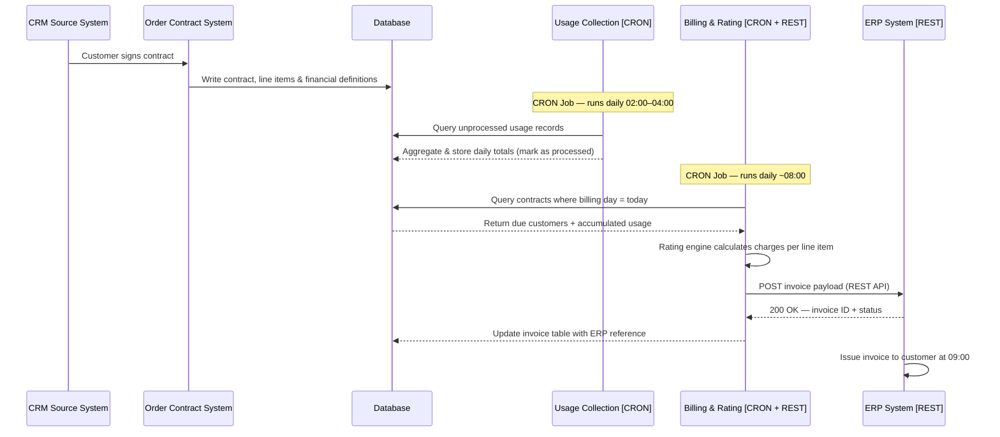
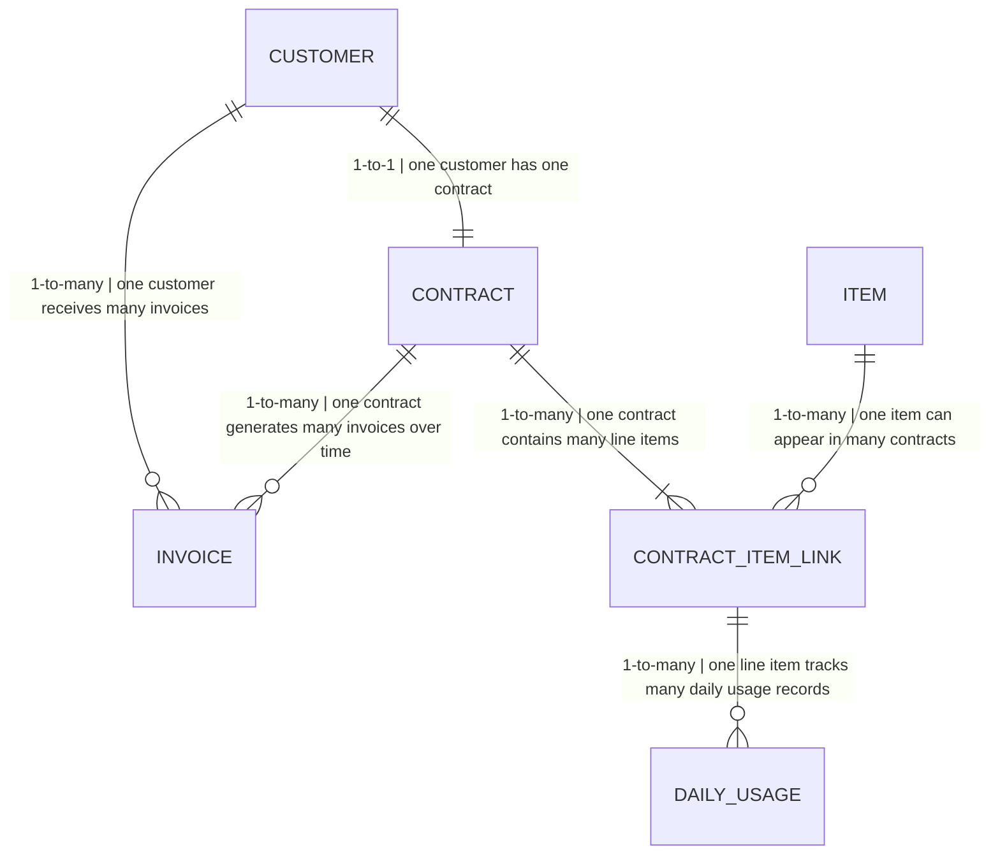
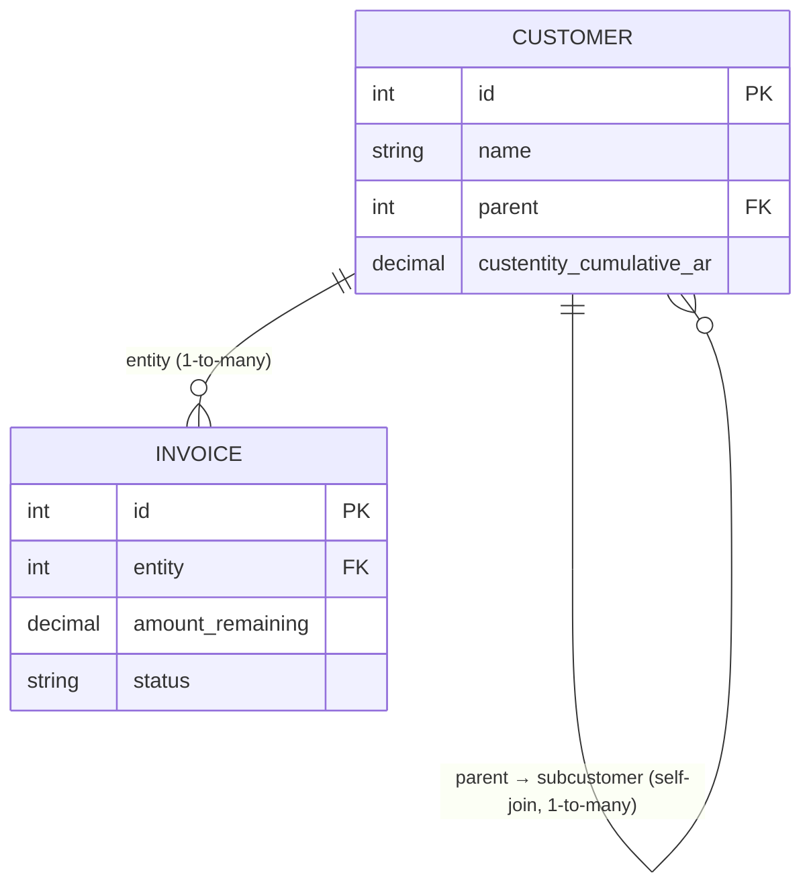
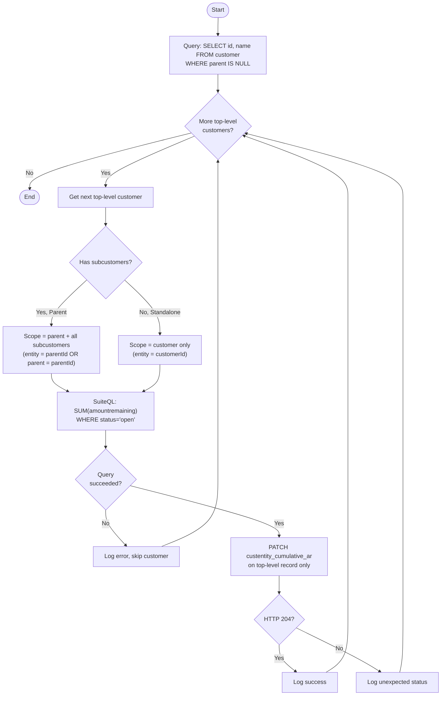

# Usage-Based Billing Process - Exercise (1)

## Process Flow


**1. Contract setup**
The process starts in the CRM when a customer signs a contract. The Order/Contract System receives the event and persists the full contract record to the database — including the `contract_start_date`, all line items, and the financial definitions that map each product to an ERP billing code. This date becomes the anchor for every future billing cycle.

**2. Daily usage collection — CRON Job (02:00–04:00)**
A CRON job runs every night in a fixed window. It queries all usage records that have not yet been processed, aggregates them by customer and product into daily totals, writes those totals to `daily_usage`, and marks each source row as processed. This prevents double-counting on the next run and keeps the job idempotent. The process is completely independent of billing — it runs every night regardless of whether any invoice is due.

**3. Billing, rating, and invoicing — CRON Job + REST Client**
A second CRON job runs each morning (around 08:00, before the 09:00 issuance deadline). To determine which customers owe an invoice today, it queries the `contract` table for all active contracts where the **day-of-month of `contract_start_date` equals today's date** — for example, on the 15th it finds every customer whose contract started on any 15th. For each matched customer, the Rating engine pulls all `daily_usage` rows accumulated since the last billing cycle and calculates the total charge per line item (usage-based items priced by consumption, fixed items by unit). The finalized invoice is pushed to the ERP system via a REST API call. The ERP returns a confirmation with an invoice ID, which is stored in the `erp_invoice_id` column of the internal `invoice` table — enabling reconciliation and preventing duplicate submissions on retries. The ERP then issues the invoice to the customer at 09:00 AM.

---

## Database Schema

### customer

```sql
postgres=# SELECT * FROM customer;

 id | name | contract_start_date
----+------+---------------------
  1 | a    | Jan-15-2026
  2 | b    | Feb-20-2026
  3 | c    | Feb-06-2026
  4 | d    | Mar-01-2026
  5 | e    | Mar-12-2026
  6 | f    | Apr-03-2026
```

---

### contract

```sql
postgres=# SELECT * FROM contract;

 id | customer_id | start_date | end_date
----+-------------+------------+------------
  1 |           1 | Jan-15-2026| Jan-14-2027
  2 |           5 | Mar-12-2026| Mar-11-2027
  3 |           2 | Feb-20-2026| Feb-19-2027
  4 |           3 | Feb-06-2026| Feb-05-2027
  5 |           4 | Mar-01-2026| Feb-28-2027
  6 |           6 | Apr-03-2026| Apr-02-2027
```

---

### usage

```sql
postgres=# SELECT * FROM usage;

 id | customer_id | contract_line_item_id | usage_duration_ts
----+-------------+-----------------------+---------------------------------------------------
  1 |           1 |                     1 | 01-01-2026 09:20:34 - 01-01-2026 10:43:00
  2 |           1 |                     1 | 02-01-2026 11:00:02 - 02-01-2026 13:30:35
  3 |           1 |                     7 | 03-01-2026 08:00:11 - 03-01-2026 09:15:10
  4 |           2 |                     3 | 04-01-2026 10:10:55 - 04-01-2026 12:00:01
  5 |           3 |                     5 | 05-01-2026 13:22:00 - 05-01-2026 15:45:33
  6 |           4 |                     2 | 06-01-2026 07:15:19 - 06-01-2026 08:00:40
```

---

### item

```sql
postgres=# SELECT * FROM item;

 id |       name        | charge_type | price
----+-------------------+-------------+-------
  1 | onboarding forms  | ongoing     | $33
  2 | analytics api     | ongoing     | $1.5
  3 | sms automation    | ongoing     | $0.8
  4 | onboarding setup  | fixed       | $250
  5 | premium support   | fixed       | $120
```

---

### contract_item_link

```sql
postgres=# SELECT * FROM contract_item_link;

 contract_id | item_id | quantity_of_fixed_price_item
-------------+---------+------------------------------
           1 |       1 | 3
           1 |       2 | 1
           2 |       3 | 5
           3 |       1 | 2
           4 |       4 | 1
           5 |       5 | 1
```

---

### daily_usage

```sql
postgres=# SELECT * FROM daily_usage;

 id | customer_id | item_id | usage_date | total_usage_duration | is_processed_2am_4am
----+-------------+---------+------------+----------------------+----------------------
  1 |           1 |       1 | 01-01-2026 | 05:10:45             | 1
  2 |           1 |       2 | 03-01-2026 | 01:00:10             | 1
  3 |           2 |       1 | 04-01-2026 | 03:22:11             | 1
  4 |           3 |       3 | 05-01-2026 | 02:10:00             | 1
  5 |           4 |       2 | 06-01-2026 | 07:45:33             | 1
```

---

### invoice

```sql
postgres=# SELECT * FROM invoice;

 id | customer_id | total_price | billing_date | erp_invoice_id | erp_status
----+-------------+-------------+--------------+----------------+------------
  1 |           1 |        1200 | Feb-15-2026  | ERP-10021      | confirmed
  2 |           2 |        3700 | Mar-20-2026  | ERP-10034      | confirmed
  3 |           3 |         950 | Mar-06-2026  | ERP-10028      | confirmed
  4 |           4 |        2100 | Apr-01-2026  | ERP-10045      | confirmed
  5 |           5 |        4300 | Apr-12-2026  | NULL           | failed
```

---


## Relationships



## Assumptions

- A customer may have multiple contracts over time (e.g., renewals or upgrades). The current model simplifies this to a 1:1 relationship, but the schema should add a `contract_id` FK on the `invoice` table if multi-contract support is needed.

## ERP Synchronization

1. Billing Rating System calculates finalized charges.
2. Middleware/API layer transforms internal billing schema into ERP-compatible format.
3. Invoice data is sent to ERP through REST API integration.
4. ERP creates the official invoice and returns invoice ID + status.
5. Internal `invoice` table is updated with `erp_invoice_id` and `erp_status` accordingly.

---

## Error Handling & Monitoring

- Any invoice with `erp_invoice_id IS NULL` was never successfully confirmed by the ERP — the billing CRON queries this on retry runs to re-attempt only unconfirmed submissions.
- `erp_status = 'failed'` distinguishes a rejected ERP call from `pending` (not yet attempted), giving on-call engineers precise visibility into what went wrong and at which stage.
- Billing process stops if usage data is incomplete — any invoice generated without full data would be incorrect, and a wrong invoice sent to a customer is harder to recover from than a delayed one.
- Monitoring alerts if invoices are not generated before 09:00.

---

# Open AR for Customer Group (NetSuite) - Exercise (2)

## 1.  Entity Relationship Diagram (ERD)
The system utilizes a relational schema with a self-referencing hierarchy and linked transactions. This structure allows the system to identify "Top-Level" parents and aggregate all related financial data.



**Relationships Map**

- **Customer Self-Join (1:M):** A Parent Customer can be linked to multiple Sub-customers via the `parent` field. `NULL` means the customer is a Top-Level Parent or Standalone.
- **Customer to Invoice (1:M):** Each Customer (Parent or Sub) can have many Invoices via the `entity` foreign key.

### Customers:
| Field | Type | Notes |
|---|---|---|
| `id` | Integer (PK) | Internal NetSuite ID |
| `name` | String | Display name, e.g. `"HiBob HQ"` |
| `parent` | Integer (FK → Customers.id) | `NULL` for Parents/Standalones |
| `custentity_cumulative_ar` | Decimal | Target custom field for aggregation |

### Invoices:
| Field | Type | Notes |
|---|---|---|
| `id` | Integer (PK) | Internal NetSuite invoice ID |
| `entity` | Integer (FK → Customers.id) | The customer this invoice belongs to |
| `amount_remaining` | Decimal | Outstanding open balance |
| `status` | String | `'open'` or `'closed'` |

## Assumptions

- The customer hierarchy is **2 levels deep only**: a top-level parent and its direct subcustomers. Sub-subcustomers (grandchildren) are not supported — the SuiteQL subquery fetches only direct children (`WHERE parent = parentId`), so any deeper nesting would be silently excluded from the AR total.

## 2. Step-by-Step Process Flow
This section describes the logical journey the system takes to ensure data accuracy and hierarchy integrity.



1. Entry Point & Identification
The process begins by scanning the Customer database. It specifically looks for "Top-Level" entities—records where the parent field is empty. This ensures the process starts only at the top level, skipping sub-customers to prevent redundant data entry.

2. Scope Definition
For every top-level customer identified, the system determines its scope — itself plus any subcustomers.

If it’s a Parent (e.g., HiBob), the scope includes itself and all subcustomers.

If it’s a Standalone (e.g., Monday.com), the scope is limited to itself.

3. Financial Data Extraction (Filtering)
The system queries the invoice table with two filters to ensure the sum is accurate:

Entity Match: It only looks at invoices belonging to the "Family Tree" identified in Step 2.

Status Check: It ignores any invoices with a status of 'closed', focusing strictly on 'open' balances.

4. Aggregation
The system sums the amount_remaining from all valid invoices found in the previous step.

Example: If Fiverr owes $10k and Wiz owes $13k, the system holds a temporary total of $23k for the HiBob Group.

5. Write Back
Finally, the system writes the total sum into the custentity_cumulative_ar field on the top-level record only. Because the process skips sub-customers in Step 1, their fields remain empty as required.

The following tables demonstrate the logic across three distinct scenarios: HiBob Group (Parent-Sub), Wix Group (Parent-Sub), and Monday.com (Standalone).

### Customer Entity Table
```sql
postgres=# SELECT id, name, parent_fk, custentity_cumulative_ar FROM customers;

 id | name         | parent_fk | custentity_cumulative_ar
----+--------------+-----------+--------------------------
  1 | HiBob HQ     | [NULL]    | 23000
  2 | Fiverr       | 1         | [NULL]
  3 | Wiz          | 1         | [NULL]
  4 | Wix HQ       | [NULL]    | 12000
  5 | Canva        | 4         | [NULL]
  6 | Figma        | 4         | [NULL]
  7 | Monday.com   | [NULL]    | 5000
```

### Invoice Transaction Table
```sql
postgres=# SELECT id, entity_fk, amount_remaining, status FROM invoices;

 id | entity_fk  | amount_remaining | status | Calculation Impact
----+------------+------------------+--------+-------------------------------
  1 | Fiverr     | 10000            | open   | Rolls up to HiBob
  2 | Wiz        | 13000            | open   | Rolls up to HiBob
  3 | Canva      | 7000             | open   | Rolls up to Wix
  4 | Figma      | 5000             | open   | Rolls up to Wix
  5 | Wix HQ     | 3000             | closed | Ignored (closed status)
  6 | Monday.com | 5000             | open   | Applied to Monday.com (Self)
```

• (Aggregation): For Parent IDs (1, 4), the script aggregates all associated Open debt from the entire hierarchy.

• (Sub-customer Restriction): For Sub-customer IDs (2, 3, 5, 6), the custom field is explicitly left [NULL].

• (Standalone): For Customers without sub-customers (ID 7), the field displays only that specific customer's open balance.

• Scalability: By using a parent FK in the ERD, the system supports multi-level nesting while specifically targeting the top-level entity for calculation.

• Performance: The schema allows for efficient querying by filtering only for open statuses, minimizing the processing load on large historical datasets.

---
## 3. The Process Code - Implementation Analysis

The implementation is written in **SuiteScript 2.1** and lives in [`netsuite-ar/src/NetSuiteARManager.js`](netsuite-ar/src/NetSuiteARManager.js). It runs **natively inside NetSuite** as a Scheduled Script, using the platform's built-in modules — no external HTTP client or authentication setup required.

```javascript
/**
 * @NScriptType ScheduledScript
 * @NApiVersion 2.1
 */
define(['N/query', 'N/record', 'N/log'], (query, record, log) => {

  function getTopLevelCustomers() {
    const results = query.runSuiteQL({
      query: `
        SELECT c.id, c.name,
               CASE WHEN EXISTS (SELECT 1 FROM customer s WHERE s.parent = c.id)
                    THEN 'T' ELSE 'F' END AS isParent
        FROM customer c
        WHERE c.parent IS NULL
      `
    });
    return results.asMappedResults();
  }

  function calculateCumulativeAR(parentId, isParent) {
    const sql = isParent === 'T'
      ? `SELECT SUM(amountremaining) AS total_ar
         FROM transaction
         WHERE type = 'CustInvc'
           AND (entity = ? OR entity IN (SELECT id FROM customer WHERE parent = ?))
           AND status = 'Open'
           AND mainline = 'T'`
      : `SELECT SUM(amountremaining) AS total_ar
         FROM transaction
         WHERE type = 'CustInvc'
           AND entity = ?
           AND status = 'Open'
           AND mainline = 'T'`;
    try {
      const params = isParent === 'T' ? [parentId, parentId] : [parentId];
      const results = query.runSuiteQL({ query: sql, params });
      const rows = results.asMappedResults();
      return Number(rows[0]?.total_ar ?? 0);
    } catch (e) {
      log.error({ title: `AR calculation failed for customer ${parentId}`, details: e.message });
      return null;
    }
  }

  function updateParentRecord(parentId, amount) {
    try {
      record.submitFields({
        type: record.Type.CUSTOMER,
        id: parentId,
        values: { custentity_cumulative_ar: amount }
      });
      log.audit({ title: 'AR Updated', details: `Customer ${parentId} updated with $${amount}` });
    } catch (e) {
      log.error({ title: `Update failed for customer ${parentId}`, details: e.message });
    }
  }

  function execute() {
    const customers = getTopLevelCustomers();
    for (const customer of customers) {
      const total = calculateCumulativeAR(customer.id, customer.isParent);
      if (total !== null) {
        updateParentRecord(customer.id, total);
      }
    }
  }

  return { execute };
});
```

### Key differences from an external integration

| Concern | External approach (wrong) | SuiteScript approach (correct) |
|---|---|---|
| Module system | `require` / `module.exports` | `define([...], fn)` AMD — SuiteScript 2.x standard |
| Authentication | Manual Bearer token in headers | Handled by the NetSuite runtime — no credentials needed |
| SuiteQL execution | `axios.post` to `/query/v1/suiteql` | `N/query.runSuiteQL({ query, params })` — fields match the schema: `name`, `parent`, `isParent`, `amountremaining` |
| Record update | `axios.patch` to `/record/v1/customer/:id` | `N/record.submitFields({ type, id, values })` |
| Logging | `console.log` / `console.error` | `N/log.audit` / `N/log.error` — visible in Script Execution Log |
| Entry point | Class constructor + method call | `execute()` function returned from `define` |
| SQL parameters | String interpolation (injection risk) | Bound `params` array — safe by design |

### • Performance Optimization

`N/query.runSuiteQL` executes directly against the NetSuite database engine — no HTTP round-trip. The database performs the `SUM` aggregation and returns a single row per parent, which is far cheaper than loading individual records.

`N/record.submitFields` is equivalent to a field-level update: it only writes `custentity_cumulative_ar` without touching any other fields, just like a `PATCH` would — but entirely within the platform with no REST overhead.

### • Data Validation

The "Mainline" Logic: The query filters for `mainline = 'T'`, which isolates the transaction header row (the authoritative total) and excludes individual line items. Without this filter, every line on an invoice would be counted separately, artificially inflating the AR total.

Parameterized Query: `params: [parentId, parentId]` binds `parentId` safely via NetSuite's query engine instead of interpolating it into the SQL string. This prevents any risk of SQL injection even on internal data.

Type Casting: `Number(rows[0]?.total_ar ?? 0)` handles the case where a customer has no open invoices — `N/query` returns `null` for an empty `SUM`, and this coerces it to `0` before writing to the record.

---
## 4. Error Handling

This section explains how the system handles failures in a production environment.

Per-Customer Isolation: Each method handles its own failures independently. If `calculateCumulativeAR` fails for a customer it returns `null` and the update is skipped for that customer only. If `updateParentRecord` fails it logs the error and continues. Only a failure in `getTopLevelCustomers` stops the entire run, since without the customer list there is nothing to process.

Resilience: A single corrupted invoice or unreachable customer record does not affect the rest of the batch.